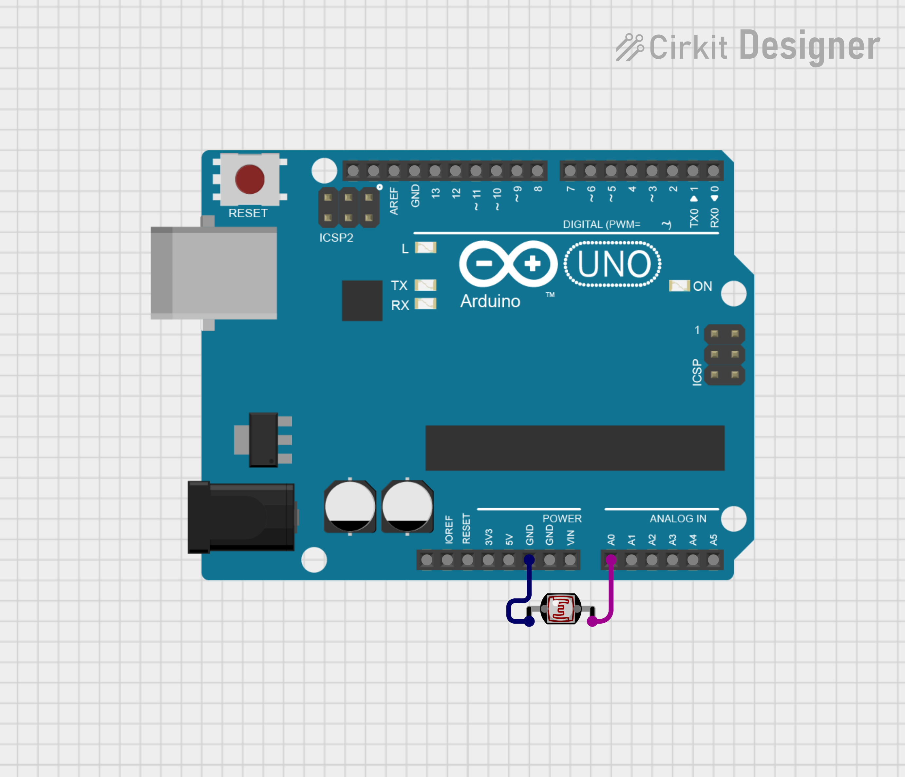

# ArduinoAutoPause

This repository contains the code to automatically pause/play media based on the amount of light in the room. It uses a photocell connected to an arduino, which communicates via Serial with a python script that controls the play/puse actions.

## Getting Started

### Prerequisites

Before you get started, make sure you have python installed on your machine, and the arduino development kit. You would also need an arduino with a photocell for this project.

### Installation and Running

To set up the ardunio and the photocell, follow the schematic below



The code is simple to use. Upload the arduino code (.ino) to the board, keep the board connected to the computer while running the python script, and start the script using the command
```
python PlayPause.py
```

Now, when the light in the room falls below a certain threshold (for example, you turn off the lights in a room), any media playing will be paused. When you enter the room again and turn on the lights, the media will start playing again.
